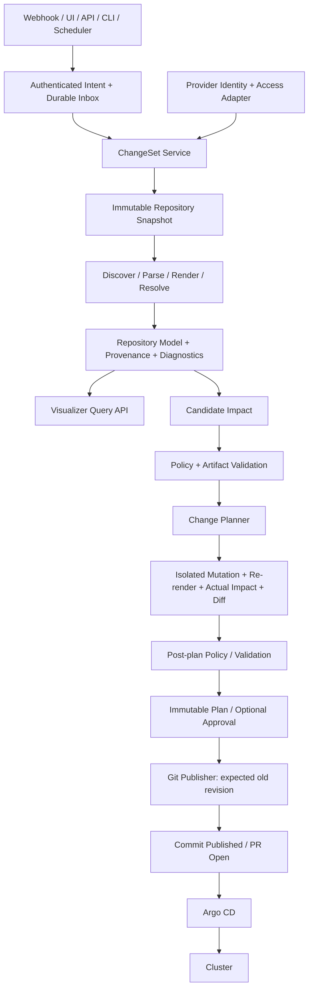

# GitOps Change Controller 설계 검토

검토일: 2026-09-27. 기준 코드: `a104778`. 이 문서는 제안 설계이며 구현 완료를 의미하지 않는다. 현재 코드의 결함과 실행 검증은 [현재 구현 분석 및 검증 결과](current-implementation-review.md)를 참조한다.

## 1. 판단과 책임 경계

목표는 타당하다. 현재 updater를 **검증된 저장소 snapshot에 대해 변경을 계획하고, 영향을 설명하고, 조건부로 publish하는 controller**로 발전시키는 것이 적절하다. Argo CD와의 경계는 `Git desired state 생성`과 `cluster reconciliation` 사이에 둔다. Kubernetes controller-runtime이나 cluster credential은 필요하지 않다.

다만 다음 요구는 범위를 정정해야 한다.

1. **Repository 전체의 완전한 해석을 약속하지 않는다.** 모든 파일을 inventory할 수는 있지만, effective state는 명시된 build target과 고정된 render input에 대해서만 정의된다. Helm의 임의 template을 항상 원본 values로 역변환하는 일반 해법은 없다.
2. **Environment는 디렉터리 이름이 아니다.** `prod`는 사용자 지정 label이다. 같은 overlay를 서로 다른 namespace나 Helm values 조합으로 사용하는 별도 target이 있을 수 있다.
3. **ChangeSet의 원자성은 한 repository의 한 ref를 갱신하는 범위다.** 여러 repo/branch와 여러 Argo Application의 동시 배포는 보장하지 않는다. 한 commit에서도 workload rollout은 순차적일 수 있다.
4. **검증은 일회성 계단이 아니다.** identity, access, registry artifact, policy는 서로 다른 시점에 바뀐다. snapshot 검증과 publish 직전 검증을 구분한다.
5. **commit 직전 HEAD 조회만으로 CAS가 되지 않는다.** 조회와 push 사이에도 변경될 수 있으므로 원격 ref 갱신 자체에 expected old revision을 건다.
6. **AST 수정과 포맷 보존은 다르다.** 현재 yaml.v3 전체 encode는 들여쓰기를 바꾼다. byte-preserving edit와 재파싱 검증이 필요하다.
7. **GitHub/GitLab API credential과 Git SSH credential은 다를 수 있다.** API의 write 정보만으로 실제 push 권한을 확정하면 안 된다.
8. **자동화와 UI가 공유할 핵심은 graph DB가 아니라 immutable RepositorySnapshot과 Plan이다.** 초기에는 Go 구조체와 SQLite 인덱스로 충분하다.

## 2. 목표 아키텍처



최초 impact는 의존 관계에서 얻는 후보이며, 변경 후 render의 semantic diff로 실제 영향을 확인한다.

Policy는 Parser를 변형하지 않는다. 대신 controller가 반복 파이프라인을 구성한다: 사실 해석 → 후보 target 선택 → 정책으로 허용 scope 결정 → 수정 위치 계획 → 실제 영향 재계산 → 정책 재검증. base 수정이 prod까지 바꾸면 dev만 허용한 최초 판정을 통과했더라도 최종 plan을 거절한다.

도메인별 사실의 출처:

| 출처 | 신뢰할 수 있는 사실 | 보장하지 않는 사실 |
|---|---|---|
| Git provider | 해당 instance의 repository identity와 관찰된 metadata | 다른 Git credential의 실제 push 성공 |
| Git commit tree | 고정 revision의 desired source | cluster 현재 상태 |
| Render input + 고정 renderer | 해당 target의 effective manifests | 다른 Argo render 설정과의 자동 일치 |
| Registry | 해당 관찰 시점의 artifact/tag/digest | 미래 tag 불변성, cluster의 pull 가능성 |
| Controller DB | intent, 승인, plan, publish 기록 | Git과 별개인 desired configuration 사본 |

RepositorySnapshot은 cache이며 Git tree를 대체하는 SOT가 아니다. registry 검증은 artifact 존재 확인이고 취약점 검사/서명 신뢰는 별도 policy 확장이다.

## 3. 핵심 domain model

다음은 구현 계약의 스케치다. 모든 개념을 별도 package나 interface로 만들라는 의미는 아니다.

```go
type RepositoryKey struct {
    Provider   string // github, gitlab
    InstanceID string // configured provider instance; includes self-hosted boundary
    NativeID   string // provider repository/project ID, treated as opaque
}

type RepositoryIdentity struct {
    Key RepositoryKey
    Owner, Name, CloneURL, DefaultBranch string // mutable metadata, not primary key
}

type SnapshotKey struct {
    Repository RepositoryKey
    Revision string
    ConfigHash, RendererHash, DependencyLockHash string
}

type BuildTarget struct {
    ID, Root, Kind string // plain, kustomize, helm
    Labels map[string]string // environment=prod, application=backend
    RenderInputs RenderInputs // release, namespace, ordered values, capabilities...
}

type ImageRef struct {
    Registry, Repository, Tag, Digest string
    Original string
}

type SourceLocator struct {
    File string
    Document int // zero-based
    Path []PathSegment // typed map key / array index, not dot-string
    BlobOID, ExpectedValue string
    Span ByteSpan // original UTF-8 byte range; exact scalar token
}

type ImageOccurrence struct {
    ID, TargetID, ResourceID, ContainerName, FieldPath string
    Effective ImageRef
    Provenance []ProvenanceEdge
    Resolution string // exact, ambiguous, unsupported, external
    WriteCandidates []SourceLocator
}

type RepositorySnapshot struct {
    Key SnapshotKey
    Files []FileRecord
    Targets []BuildTarget
    Resources []ResourceInstance
    Occurrences []ImageOccurrence
    Edges []DependencyEdge
    Diagnostics []Diagnostic
    Completeness map[string]Coverage // per target; complete, partial, unsupported
}
```

`ResourceInstance`의 identity는 `(targetID, group, kind, namespace, name)`을 기본으로 하되 원본 locator와 변환 lineage를 함께 가진다. 같은 base가 dev/prod에 render되면 source resource 하나와 effective resource 두 개가 생긴다. 단순 Kubernetes name만으로 합치지 않는다. resource rename/recreate의 snapshot 간 동일성은 증명되지 않으면 추정으로 표시한다.

이미지 하나에 `Current: v1.3.0`을 저장하지 않는다. dev=v1.4, prod=v1.3일 수 있으므로 current/proposed는 **occurrence 또는 target별 상태**다. `ghcr.io/foo/api`라는 image name, 특정 digest artifact, resource의 사용 occurrence는 별개 엔터티다.

Environment와 Override를 무조건 독립 aggregate로 만들 필요는 없다. Environment는 초기에는 BuildTarget label, Override는 provenance edge 및 write candidate로 표현할 수 있다. 관리 주기와 권한 모델이 생길 때 별도 엔터티로 승격한다.

## 4. Parser / Renderer / Resolver

하나의 거대 `Parser.Parse(repo)` 대신 내부 단계를 나누되 facade는 하나로 유지한다.

```text
Discover(snapshot) → inventory + target candidates
ParseSources(snapshot) → source ASTs + syntax diagnostics
Render(target, locked inputs) → effective resources
Resolve(source facts, effective resources) → lineage + write candidates + confidence
Analyze(snapshot model) → reverse indices + dependency closure
```

명시적 target 등록을 우선한다. 자동 discovery는 후보만 제안한다. controller 소유 설정에 root, renderer version, environment labels, Helm render inputs를 저장하거나, 버전 관리되는 repository 설정을 사용할 수 있다. repository 설정이 보안 정책 자체를 완화할 수 없도록 허용 정책의 신뢰 경계를 분리한다.

### Plain YAML

- Pod, Deployment, StatefulSet, DaemonSet, Job, CronJob 등 알려진 PodSpec 경로만 기본 추출한다. initContainers도 포함하고 Kubernetes List의 items도 처리한다.
- 사용자 정의 CRD는 선언된 field mapping으로 확장한다. 알 수 없는 `image` 필드는 발견 후보로 표시할 수 있지만 자동 수정 대상으로 인정하지 않는다.
- multi-document index, resource key, container name과 source locator를 연결한다. sequence index는 snapshot 내 주소이지 영구 identity가 아니다.
- YAML anchors/aliases, merge key, 중복 key, template 문법은 별도 진단한다. anchor 원본 변경이 여러 소비자에 영향을 주면 영향 closure가 확인되기 전 자동 수정하지 않는다.
- 등록된 target에 속하지 않는 예제/테스트 fixture는 inventory에는 있어도 배포 영향으로 집계하지 않는다.

### Kustomize

공식 renderer와 동일한 build 결과를 얻는 것과 원본 필드의 provenance를 아는 것은 별도 문제다. 고정 버전 Kustomize를 render oracle로 사용하고, 지원하는 source transformation에 대해 provenance를 만든다. base/overlay, images, patches, replacements 등의 의미는 공식 구조를 따른다. [Kustomize 문서](https://kubernetes.io/docs/tasks/manage-kubernetes-objects/kustomization/)

초기 지원 범위는 local resources/base/overlay와 검증 가능한 `images` 변환이다. `newName`, `newTag`, `digest`를 분리하고, 여러 단계 override의 최종 winner를 추적한다. 입력 name과 최종 registry/name은 달라도 같은 lineage로 조회할 수 있어야 한다.

```text
base Deployment image: ghcr.io/foo/api:v1
    → dev images override: v2 → effective dev api:v2
    → prod images override: v3 → effective prod api:v3
```

prod를 v4로 변경하는 경우 prod의 `newTag`가 target이다. base를 v4로 바꿔도 prod override가 남으면 effective prod는 v3다. 인덱스는 이 차이를 설명해야 한다.

prod override가 없고 dev/prod가 base를 공유하면 base 수정은 둘 다 바꾼다. dev만 허용된 intent라면 dev override를 **추가하는 구조 변경**이 필요할 수 있다. scalar 교체만 지원하는 MVP는 이 요청을 명시적으로 거절한다. 숨은 base 수정으로 대체하지 않는다.

patch/replacement/component/custom transformer가 image 결정에 개입하면 지원 adapter로 lineage를 증명하거나 `ambiguous/unsupported`로 남긴다. build 결과가 나온다는 이유만으로 자동 수정 가능 판정을 하지 않는다. remote base는 고정 commit과 허용된 fetch policy가 필요하며, upstream source 파일을 해당 ChangeSet에서 직접 고치지 않는다.

### Helm

Helm은 source parser 외에 **render target 정의와 write-back 계약**이 필수다. chart version/content digest, dependency archive hash, values 파일 순서, release name, namespace, API capabilities, renderer version을 고정한다. Chart.lock만으로 실제 dependency artifact 내용까지 고정됐다고 가정하지 않는다.

렌더링된 image가 `printf`, `include`, `tpl`, 조건문, subchart/global values를 거쳐 만들어졌다면 어떤 input을 바꿔야 하는지 자동 역추적이 모호하다. 따라서 초기 mutation은 명시적 binding으로 제한한다.

```yaml
targets:
  - id: backend-prod
    kind: helm
    root: charts/backend
    valuesFiles: [values.yaml, environments/prod.yaml]
    imageBindings:
      - image: ghcr.io/foo/api
        writeFile: environments/prod.yaml
        repositoryPath: /image/repository
        tagPath: /image/tag
```

binding은 사실의 증명이 아니라 후보 위치다. values override precedence를 확인하고, 수정 후 render에서 의도한 occurrence가 바뀌며 다른 resource의 의미가 바뀌지 않았는지 검증해야 한다. template 안의 하드코딩된 문자열을 정규식으로 바꾸는 fallback은 두지 않는다.

`lookup`은 cluster 정보에 의존할 수 있으므로 repository-only 해석의 한계다. cluster 접근을 끈 offline render profile과 불완전성 진단을 사용한다. random/time/network-dependent output은 결정성을 확인할 수 없으면 자동 mutation을 지원하지 않는다. [Helm lookup 문서](https://helm.sh/docs/chart_template_guide/functions_and_pipelines/)

Argo가 별도 parameters/valueFiles/build options를 주입한다면 repository 단독으로 그 실효 상태를 확정할 수 없다. UI의 effective는 “등록된 render profile 기준”이라고 표시한다. Application/ApplicationSet/multi-source 메타데이터 adapter는 후속 단계다.

## 5. Repository Validation과 registry 검증

각 검증 결과는 `check, status(pass/fail/unknown/not_applicable), code, evidence, observedAt, validUntil, scope, credentialVersion`을 가진다. L1–L5는 사용자 표시 분류로 유지하되 실행 의존성은 DAG로 구성한다.

| 계층 | 검증 | 실패/불명확 처리 |
|---|---|---|
| L1 Identity | provider instance, repository ID, 현재 canonical URL | 확인되지 않은 identity의 mutation 금지 |
| L2 Access | API read, Git read, Git write 추정, PR 생성 권한을 분리 | write unknown을 writable로 표시하지 않음 |
| L3 Git | 명시적 target ref 존재, revision, rules/protection, publish mode | direct push 불가 시 승인된 PR mode 또는 차단 |
| L4 Structure | target root, 종속 파일, pinned dependencies, parse/render completeness | 관련 target 불완전이면 자동 수정 차단 |
| L5 Semantic | image occurrence, 유일한 target, expected current, post-render intent 충족 | no_match/ambiguous/conflict 구분 |

GitHub는 repository metadata/permissions와 branch protection/rulesets를, GitLab은 project metadata와 branch/protection 정보를 adapter로 읽는다. provider마다 credential 종류·권한·규칙 표현이 다르므로 공통 boolean으로 손실 변환하지 않는다. [GitHub repository API](https://docs.github.com/en/rest/repos/repos), [GitLab projects API](https://docs.gitlab.com/api/projects/), [GitLab protected branches API](https://docs.gitlab.com/api/protected_branches/)

공통 capability는 `canReadGit`, `canInspectRules`, `canDirectPush`, `canCreateBranch`, `canOpenPR`, `requiresSignedCommit`, `requiresChecks`처럼 관찰 결과와 근거를 가진다. provider가 정보를 주지 않거나 404가 권한 은폐인지 구분되지 않으면 unknown이다. 테스트 commit을 push해서 사전 권한을 확인하지 않는다. 최종 publish 실패는 언제나 가능한 정상 상태다.

canonical key는 `(provider instance, native repository ID)`다. 이름 변경은 metadata 갱신이고, 같은 이름으로 재생성된 다른 ID는 새 repo다. fork는 별도 identity다. 이전 identity와 연결을 증명하지 못한 host 이동/마이그레이션은 자동 동일시하지 않는다. default branch 변화가 등록된 target ref를 자동 변경해서도 안 된다.

등록된 provider endpoint/clone endpoint/credential binding을 사용하고 webhook payload가 임의 clone URL이나 registry endpoint를 정하지 못하게 한다. private registry와 self-hosted provider는 명시적으로 허용된 endpoint로 취급한다. repo-controlled symlink, submodule, remote dependency, renderer plugin의 경계도 같은 등록 정책으로 통제한다.

renderer에는 Git/registry write credential과 kubeconfig를 전달하지 않는다. 외부 dependency는 별도 fetch adapter가 고정된 artifact로 제공하고, render 실행은 기본 network 차단 및 시간·메모리·파일 크기·출력 크기 제한을 둔다. custom plugin, post-renderer, repository의 임의 script는 명시적으로 지원하기 전 실행하지 않는다. credential cache는 provider/repo뿐 아니라 실제 principal과 credential version으로 scope를 분리한다.

registry는 catalog 나열 대신 정확한 image repository/reference의 manifest HEAD/GET을 사용한다. auth challenge, media type negotiation, tag→digest resolve, multi-platform index와 child manifest digest의 차이를 처리한다. webhook digest와 조회한 artifact가 충돌하면 늦은 이벤트 또는 tag 재지정으로 분류한다. 인증 실패/접근 불명확을 “이미지 없음”으로 합치지 않는다. [Distribution API](https://distribution.github.io/distribution/spec/api/)

안정적인 desired artifact가 필요하면 digest pin을 plan에 포함한다. tag-only 모드는 commit 후에도 tag가 다른 digest를 가리킬 수 있다는 의미를 UI에 보존한다. 검증 순간의 tag 확인만으로 이후 불변성을 보장할 수 없다.

## 6. Intent, ChangeSet, Plan, Mutation

```text
Intent       = 사용자의 목적; 무엇을 어느 scope에서 바꿀지
ChangeSet    = 한 repo/ref에 적용할 하나 이상의 intent/change를 묶은 논리 단위
PlanRevision = 특정 snapshot에서 계산한 불변의 구체적 변경안
Execution    = 해당 plan의 publish 시도와 관찰된 결과
Job          = 위 작업을 실행시키는 scheduling 단위
```

```go
type Intent struct {
    ID, ActorID, Source string
    IdempotencyKey, PayloadHash string
    Repository RepositoryKey
    TargetRef string
    Changes []ImageChange // image selector, target selector, desired ref, expected current
    ReleaseID string // optional explicit grouping; do not infer release from arrival time
}

type ChangeSet struct {
    ID string
    Repository RepositoryKey
    TargetRef string
    IntentIDs []string
    Changes []ImageChange
    State string
    CurrentPlanID string
}

type PlanRevision struct {
    ID, ChangeSetID string
    Snapshot SnapshotKey
    PolicyRevision, PlanHash string
    Mutations []Mutation
    Impact ImpactReport
    Validation []ValidationResult
    ProposedDiff string // potentially stored externally; access-controlled
    PublishMode string // local_only, direct, pull_request
    ExpiresAt time.Time
}

type Mutation struct {
    Source SourceLocator
    OriginalValue, NewValue string
    Reason, OccurrenceID string
}

type PublishAttempt struct {
    ID, PlanID, TargetRef string
    ExpectedOldOID, ProposedCommitOID, ProposedTreeOID string
    Status string // prepared, publishing, published, unknown, rejected
}
```

초기 ChangeSet은 항상 all-or-nothing으로 처리한다. 독립 업데이트는 change 하나를 담은 ChangeSet, release는 여러 change를 담은 ChangeSet으로 표현한다. 이렇게 하면 필요할 때 묶을 수 있으면서도 `Atomic=false`의 부분 성공 규칙을 도입할 필요가 없다.

Atomic=true에서 일부 invalid이면 파일을 쓰기 전 전체 거절한다. 같은 scalar에 같은 변경이 중복되면 한 mutation으로 합치고, 서로 다른 새 값이면 conflict다. 서로 다른 image binding이 하나의 global Helm tag를 공유하는 경우도 같은 규칙으로 충돌 검출한다.

release grouping은 명시적 create/add/seal 또는 한 요청의 changes 배열로 한다. webhook 도착 시간으로 backend/frontend가 같은 release인지 추정하지 않는다. 자동 release 집계가 필요하면 expected component 목록과 deadline을 가진 별도 coordinator가 sealed ChangeSet을 생성한다. deadline에 일부만 들어왔다고 임의 부분 commit하지 않는다.

상태 흐름:

```text
received → validating → planned → awaiting_approval(optional)
  → publishing → published
              → pr_open → merged / closed
              → publish_unknown → reconcile_publish
planned → rejected / conflict / expired / superseded / already_satisfied
```

`local_only`는 `commit_created`이며 `published`가 아니다. PR 생성도 대상 branch 변경 완료가 아니다. job의 transient retry 상태와 ChangeSet의 사용자 관점 상태를 분리한다.

승인은 `PlanHash`에 묶는다. hash에는 repo/ref, base revision, renderer/config/dependency lock, policy revision, artifact digests, mutations, 최종 diff/impact를 포함한다. replan하면 새 plan이며 이전 승인을 재사용하지 않는다. 승인되지 않은 자동화 scope에서는 정책이 자동 publish를 허용할 수 있다.

최소 mutation 절차:

1. 고정 snapshot blob에서 source locator와 original value, blob hash를 확인한다.
2. scalar token의 정확한 byte span을 파악한다. yaml.v3의 line/column만으로 끝 위치를 추정하지 않는다.
3. quote/escape/type을 보존해 새 scalar를 encoding한다. tagged scalar, multiline, anchor 등 미지원 문법은 거절한다.
4. 한 파일의 edits는 겹침을 검사하고 뒤 offset부터 적용한다. span 외 bytes, CRLF, BOM, 주석, key order는 유지한다.
5. 바뀐 모든 파일을 재파싱하고 모든 영향 target을 재렌더한다. 원래 값과 달라졌거나 요청 외 semantic diff가 생기면 실패시킨다.
6. 생성된 정확한 blobs로 tree와 commit을 만든다. 임시 worktree 사용 시 모든 edit/검증이 끝난 후에만 commit한다.

신규 override/key 삽입은 scalar 교체와 다른 mutation kind다. 별도 formatter-aware 삽입과 diff 검증이 준비된 뒤 도입한다. strict 모드에서 전체 파일 encode fallback은 하지 않는다.

## 7. Image dependency graph와 영향 계산

graph는 IR의 query projection이다. 초기 저장은 snapshot별 typed adjacency와 SQLite 테이블이면 충분하다.

| Node | 주요 edge |
|---|---|
| File/Document/SourceField | defines, includes, supplies_value |
| BuildTarget | depends_on, renders, labels(environment) |
| SourceResource / ResourceInstance | derived_from, uses_image |
| ImageName / Artifact | resolves_to, consumed_by |
| Override/Transform | overrides, contributes_to, effective_in |

```text
ImageName ghcr.io/foo/api
  ├─ SourceField base/deployment.yaml → source resource backend
  ├─ Override dev/kustomization.yaml → dev/backend/api:v2
  └─ Override prod/kustomization.yaml → prod/backend/api:v3
```

역조회 인덱스는 정규화된 image name뿐 아니라 원본 name, rename 결과, digest artifact, occurrence 사이의 관계도 보존한다.

Impact API가 반환할 집합을 구분한다.

- `referencingTargets`: 현재 해당 image lineage를 참조하는 target.
- `selectedTargets`: intent와 policy가 이번 변경 대상으로 선택한 target.
- `changedTargets`: 제안한 mutation을 render했을 때 실제로 바뀐 target.
- `unintendedChanges`: selected 밖에서 발생한 변경 또는 요청하지 않은 resource field 변경.
- `unresolvedTargets`: 영향이 없다고 증명하지 못한 target.
- `mutationTargets`: 실제 편집할 source locator. source definition 파일과 다를 수 있다.

base 이미지와 prod override가 연결돼 있다는 이유로 “base tag 변경 → prod effective 변경”이라고 표시하지 않는다. traversal은 후보 closure이고 before/after render가 실제 변화를 확인한다. alias/shared values가 여러 resource를 바꾸면 모두 포함한다. reverse edge completeness가 부족하면 전체 target 재계산 또는 해당 자동 변경 차단이 안전하다.

파일 이동과 unrelated commit은 새로운 snapshot으로 재색인한다. 장기적으로 content hash 기반 증분 계산을 도입할 수 있지만 MVP는 정확한 전체 target build를 우선한다. cycles, missing dependencies, renderer limits는 graph diagnostics로 표시한다.

## 8. Git 동시성, 잠금, CAS, 복구

### 잠금과 snapshot

- MVP: 단일 active writer + SQLite. 현재 운영 형태를 유지한다.
- 논리적 직렬화 key: `(provider instance, repository ID, target ref)`.
- 같은 mono-repo branch의 다른 app/path도 같은 ref를 바꾸므로 publish는 직렬화한다. path별 lock만으로는 충분하지 않다.
- plan 계산은 immutable snapshot에서 병렬화할 수 있다. lock은 correctness의 최종 방어선이 아니라 불필요한 충돌을 줄이는 장치다.
- 작업별 분리된 checkout 또는 blob/tree object construction을 사용한다. 공유 workspace에서 `fetch/reset/mutate`를 병렬 수행하지 않는다.
- scale-out은 별도 단계다. owner/lease/heartbeat와 DB 상태 전이 fencing이 필요하고, remote ref CAS도 계속 필요하다. 외부 Git은 DB fencing token을 자동 이해하지 않으므로 이를 강한 분산 transaction으로 표현하지 않는다.

### 현재 라이브러리를 활용하는 CAS

현재 의존성 `go-git/v6 v6.0.0-alpha.4`의 `PushOptions`에는 `RequireRemoteRefs`가 있다. 설치된 source의 `options.go`와 `remote.go:checkRequireRemoteRefs`에서 확인했다. 따라서 CAS 때문에 Git 구현을 즉시 전면 교체할 필요는 없다.

계약은 `Publish(expectedOld=B, newCommit=N, targetRef=R)`이고 `N`은 `B`를 유일한 parent로 가지는 새 commit이다. 명시적 refspec으로 하나의 branch만 push하고 `Force=false`, `RequireRemoteRefs = [B:R]`를 설정하는 adapter를 후보로 삼는다. advertised old ref 검증 뒤 receive-pack의 old/new 조건부 갱신까지 포함해 실제 Git 서버와의 경쟁 테스트가 필요하다.

일반 push의 non-fast-forward 거절은 유용하지만 정확히 B를 기대했다는 계약과 동일하지 않다. 예를 들어 remote가 B의 조상으로 rewind된 경우에도 오래된 plan을 그대로 publish하지 않도록 해야 한다. 사전 HEAD 재조회는 빠른 실패용으로만 사용한다. Git의 명시적 expected ref lease 의미도 이 경계를 설명한다. [Git push 문서](https://git-scm.com/docs/git-push)

```text
snapshot B → plan P → new tree T → commit N(parent=B)
persist PublishAttempt(B, T, N, P)
push expected B → N to explicit ref
  success  → record published N
  mismatch → new snapshot + resolve + policy + new plan
  timeout  → publication unknown; inspect remote before replay
```

stale plan을 자동 rebase/cherry-pick만 해서 승인된 것으로 취급하지 않는다. source 값/override 승자/policy/영향 범위가 바뀔 수 있으므로 재해석한다. 자동 intent에는 제한된 replan 횟수와 jitter를 두고, preview 승인 작업은 새 승인을 요구한다.

### DB와 Git 사이의 실패 구간

Git push와 SQLite commit을 함께 atomic하게 만들 수 없다. “exactly once”라고 광고하지 않고 durable inbox + effect reconciliation으로 설계한다.

- push 전에 exact commit OID와 plan hash, attempt를 영속화한다. 재시도마다 timestamp가 다른 새 commit을 만들지 않는다.
- push 응답을 잃으면 remote HEAD와 ancestry에서 제안 commit을 확인한다. downstream commit이 더 생겼다면 HEAD 동일성만 검사해서는 안 된다.
- commit이 원격 history에 있으면 publish 기록을 복구한다. 그 뒤 사람이 revert했어도 옛 작업을 자동 재적용하지 않는다.
- remote에 없고 ref가 B면 동일 attempt 재시도가 가능하다. ref가 다르면 conflict/replan이다.
- force rewrite/PR squash 등으로 commit 존재 여부를 확정하지 못하면 provider PR/merge 기록도 확인하고, 끝내 모르면 unknown을 유지한다. 현재 파일 내용 일치만으로 “우리 commit이 publish됐다”고 주장하지 않는다.
- 승인 취소는 publishing 시작 이후 원격 전송을 확실히 되돌리지 못한다. 성공했다면 취소가 아닌 별도 revert intent로 다룬다.

### 순서와 중복

delivery dedup key는 `(source connection, delivery ID)`다. 동일 key/동일 payload hash는 기존 결과, 동일 key/다른 hash는 409다. API의 idempotency key에도 같은 계약을 적용한다. inbox 기록과 최초 ChangeSet 생성은 같은 DB transaction에서 한다.

artifact 이벤트에는 source-scoped ID 외에 image/tag/digest와 release sequence를 보존한다. “같은 digest를 영구 무시”하면 나중의 의도적인 재승격도 막히므로 delivery dedup, effect no-op, release supersession을 구분한다.

SemVer 비교는 opt-in 정책이다. 모든 tag가 정렬 가능한 버전은 아니다. 발신 timestamp나 webhook 도착 순서를 최신성의 근거로 삼지 않는다. 자동 promotion은 expected current 또는 신뢰된 monotonic release sequence로 보호하며, 수동 rollback은 명시적 권한을 가진 별도 intent다.

### multi-repo / PR

여러 repo에 동일 image가 있으면 intent가 repo scope를 지정하거나 등록 정책이 선택한다. 각 `(repo, ref)`별 child ChangeSet을 만들고 상위 ReleaseGroup이 상태를 집계한다. 서로 다른 repo에 대한 atomic publish는 제공하지 않는다. 실패 보상은 새 commit이며 자동 되돌리기도 또 다른 충돌 가능 작업이다.

PR 모드는 deterministic controller branch와 source/base OID, plan hash를 기록한다. base 변경, source branch 외부 변경, merge queue의 합성 결과는 재검증이 필요하다. PR 본문의 preview만으로 merge 시점 안전성이 보장되지 않는다. merge 전 필수 검증이 최종 diff/target에 연결되지 않으면 controller 보장은 “검증된 제안 생성”까지다.

## 9. Webhook → commit sequence

1. 입력 adapter가 서명/인증/권한/크기/schema를 확인한다. Zot host는 등록된 registry와 대조한다. GitHub 이벤트는 등록된 repository ID/ref와 대조한다.
2. source-scoped delivery key와 payload hash를 inbox에 저장한다. 중복이면 기존 ChangeSet/상태를 반환한다. DB에 durable하게 기록된 뒤 202 응답한다.
3. registry adapter가 image/tag/digest를 확인한다. repository index의 후보를 조회하되 index revision을 확인한다.
4. 명시적 routing policy로 repo/ref와 target scope를 선택한다. release envelope가 있다면 seal된 변경 목록을 사용한다.
5. repository identity/access/branch를 확인하고 exact revision B의 snapshot을 획득한다.
6. 등록된 모든 관련 build target을 parse/render/resolve한다. unsupported 대상은 숨기지 않고 completeness에 반영한다.
7. requested image occurrence와 expected current를 검증하고 candidate impact를 계산한다.
8. policy로 허용 target과 publish mode를 정한다. automation 금지와 manual 승인 요구를 별도 판단한다. `Force`로 검증을 우회하지 않는다.
9. ChangeSet 전체의 write candidates를 resolve하고 충돌을 검사한다. isolated blobs에 적용한 뒤 재파싱/재렌더한다.
10. before/after semantic diff로 실제 영향과 불필요한 변경을 확인하고 policy를 다시 적용한다. immutable plan과 diff를 저장한다.
11. preview 또는 필요한 승인을 제공한다. 자동 허용된 변경은 그대로 다음 단계로 간다.
12. branch 직렬화 구간에서 freshness, policy/credential/approval 유효성을 재확인한다. expected ref B를 사용해 한 commit을 publish한다.
13. 결과 또는 unknown attempt를 영속화하고 snapshot index를 갱신한다. 자체 Git webhook은 refresh 이벤트로 처리하며 새 image intent로 되먹임하지 않는다.
14. Argo CD가 commit을 감지한다. controller는 deploy 성공을 주장하지 않는다.

## 10. Visualizer API 계약

명령 API와 조회 API를 구분하되 같은 snapshot/plan을 읽는다. 브라우저가 받은 node ID를 편집 가능한 파일 경로로 곧바로 신뢰하지 않는다. 모든 권한과 source locator는 서버에서 재해석한다.

| API | 용도 |
|---|---|
| `POST /api/v1/repositories` | 허용된 provider connection에 repo 등록 및 canonical identity resolve |
| `GET /api/v1/repositories/{id}` | 현재 metadata와 capability/validation 상태 |
| `POST /api/v1/repositories/{id}/validations` | 비동기 재검증 |
| `POST /api/v1/repositories/{id}/snapshots` | ref의 새 snapshot/index 생성 |
| `GET /api/v1/snapshots/{sid}/targets` | target와 environment labels, render profile |
| `GET /api/v1/snapshots/{sid}/graph?root=...&depth=...&cursor=...` | typed nodes/edges와 completeness |
| `GET /api/v1/snapshots/{sid}/images?name=...&cursor=...` | image name별 occurrence 역조회 |
| `GET /api/v1/snapshots/{sid}/images/{id}/occurrences` | target별 current와 source/override lineage |
| `POST /api/v1/intents` | 모든 입력 채널이 정규화해서 호출하는 명령 서비스 |
| `POST /api/v1/changesets` | 명시적인 복수 image release 생성 |
| `POST /api/v1/changesets/{id}/plans` | 특정 변경 목록으로 immutable preview 생성 |
| `GET /api/v1/plans/{pid}` | snapshot, policy, mutations, 영향, 진단, hash |
| `GET /api/v1/plans/{pid}/diff` | unified diff 및 semantic diff |
| `POST /api/v1/plans/{pid}/approvals` | exact plan hash에 대한 권한 있는 승인 |
| `POST /api/v1/plans/{pid}/publish` | plan hash를 확인하고 publish 작업 예약 |
| `GET /api/v1/changesets/{id}` | 상태·attempt·commit/PR·오류·재시도 가능 여부 |
| `GET /api/v1/repositories/{id}/history?cursor=...` | controller 변경 이력 및 외부 commit 구분 |
| `GET /api/v1/events` | SSE로 상태 변경 전달; polling fallback 가능 |

모든 snapshot 응답은 `snapshotID`, `revision`, `indexedAt`, `completeness`를 포함한다. 서로 다른 revision의 graph와 current 값을 화면에서 조합하지 않는다. write 요청은 idempotency key와 payload hash, 상태 변경에는 version/If-Match를 사용한다.

```json
{
  "planId": "plan-42",
  "baseRevision": "abc123",
  "completeness": "complete",
  "image": "ghcr.io/foo/api",
  "occurrences": [
    {"target": "dev", "current": "v1.3.0", "proposed": "v1.4.0", "decision": "allow"},
    {"target": "prod", "current": "v1.2.0", "proposed": "v1.2.0", "decision": "deny_automation"}
  ],
  "referencingTargets": ["dev", "prod"],
  "changedTargets": ["dev"],
  "mutationTargets": ["overlays/dev/kustomization.yaml"],
  "unresolvedTargets": []
}
```

error code는 `identity_unverified`, `write_unknown`, `path_missing`, `parse_failed`, `render_unsupported`, `reference_ambiguous`, `expected_value_conflict`, `stale_plan`, `branch_protected`, `artifact_missing`, `artifact_changed`, `publish_unknown`처럼 기계 판독 가능하게 한다. protected 자체를 error로 단정하지 말고 선택한 publish mode를 막는지 함께 표시한다.

history는 DB의 actor/intent/plan/commit 연결을 우선 사용한다. 외부 commit은 parent/child snapshot을 비교해 image/environment 변경을 계산하거나 미분석으로 표시한다. commit author와 API actor는 구분한다. diff에 Secret/values가 포함될 수 있으므로 조회 권한·redaction·감사 기록이 필요하다.

## 11. Package와 단계적 이전

초기에는 하나의 Go module, 하나의 service binary를 유지한다.

```text
cmd/server, cmd/cli
internal/
  domain/             identity, snapshot, target, intent, plan, result
  controller/         planning, publication orchestration, recovery
  repository/         snapshot acquisition, discovery, IR, graph queries
    plain/
    kustomize/
    helm/
  policy/             target authorization, promotion, publish rules
  mutation/           guarded scalar edits, diff, post-change validation
  git/                transport, object/checkout adapter, expected-ref publisher
  provider/           github, gitlab identity/access adapters
  registry/           reference parsing, artifact resolution
  store/              SQLite migrations, inbox, ChangeSets, plans, attempts
  transport/          HTTP DTOs, webhook adapters, query API
```

domain은 Fiber, go-git, yaml.Node, SQLite에 의존하지 않는다. yaml.Node와 byte buffer는 parser/mutator 내부에 둔다. 작은 자료형마다 interface를 만들지 않고 Git publisher/provider/registry/store/renderer처럼 I/O 경계에서 필요한 계약만 추상화한다.

이전 순서:

1. `Job`을 public HTTP payload와 분리한다. 기존 endpoint는 호환 adapter로 유지하며 요청 하나를 intent 하나로 변환한다.
2. `JobStore`의 migration/claim/backoff를 `store`로 이동하되 Job은 실행 큐로 유지한다. ChangeSet과 publish attempt용 테이블을 추가한다.
3. `gitManager`에서 Git transport/auth와 snapshot/publisher를 분리한다. 반환값 `bool`은 typed outcome/error로 바꾼다.
4. `imageToFiles`를 revision-bound plain model projection으로 먼저 바꾼다. 기존 updater는 production fallback으로 남기지 않고 새 planner로 하나씩 이관한다.
5. byte-preserving writer, expected-ref publish, crash recovery를 붙인다. 기존 health/status/SSH 테스트는 유지한다.
6. 제한된 Kustomize와 query API를 붙이고 이후 Helm binding을 도입한다.

이번에는 구조를 정하기 위한 검토이므로 대규모 코드 이동이나 반쯤 동작하는 IR 추가는 하지 않았다. 현황 분석 문서에 기록한 결함의 수정과 model 전환은 실제 fixture 및 publish 경쟁 테스트와 함께 구현해야 한다.

## 12. MVP와 후속 단계 / 완료 기준

2026-09-27 구현 상태: [CLI MVP](cli-mvp.md)에 단일 repo/ref, 제한된 plain/Kustomize 모델, 영속 ChangeSet, GitHub/registry gate, scalar edit, CAS 및 CLI 사용법을 기록했다. 아래 표는 전체 목표 로드맵이며 완료 목록이 아니다. 사용자의 후속 결정으로 웹 UI는 현재 구현에서 제외했다.

| 단계 | 범위 | 완료 기준 |
|---|---|---|
| 0: 기존 updater 정확성 | revision-bound index, workspace identity binding, typed outcomes, digest 처리·늦은 retry 방지 | 새 manifest를 fetch한 작업이 빠짐없이 반영되며 다른 repo workspace를 재사용하지 않음 |
| 1: 안전한 controller MVP | GitHub 한 instance, 단일 active writer, repo/ref 하나씩 처리, plain + 제한된 local Kustomize images, SQLite, 복수 image ChangeSet, preview/diff, 최소 scalar edit, registry artifact 검증, CAS publish | 잘못된 identity/부분 해석/모호한 target/stale plan에서 commit 없음; 지원 fixture는 한 commit으로 정확히 변경 |
| 1 UI | repo 검증 상태, target별 image current/proposed, 영향/파일 diff, history | UI와 automation이 같은 snapshot/plan을 조회하고 revision 혼합 없음 |
| 2 | Helm explicit bindings, GitLab, PR lifecycle, override 삽입, 더 많은 Kustomize transformations | chart values precedence와 공유 값의 부수 영향을 render diff로 검증 |
| 3 | 여러 repo 관리, ReleaseGroup, Argo/Flux metadata, pinned remote dependencies, incremental indexing | 부분 성공과 coverage를 숨기지 않으며 외부 dependency revision 추적 |
| 4 | multi-worker/HA, leases, query 확장, 고급 policy | 장애·lease expiry·동시 publish 테스트로 중복/역행 제어 검증 |

Helm을 MVP 필수로 해야 한다면 “임의 chart 지원” 대신 **등록된 chart + explicit values binding + 고정 render inputs**를 MVP 계약에 넣고 시각화 범위를 줄인다. 지원하지 않는 chart를 plain YAML 검색으로 처리하지 않는다.

필수 검증 fixture / 실패 주입:

- plain multi-doc, CronJob/initContainers/List, ConfigMap 오탐 배제, custom field mapping.
- registry port, tag-only, digest-only, tag+digest, mutable tag 재지정, multi-platform index.
- 같은 base의 dev/staging/prod, override 승자, rename, 공유 patch/global values, 미지원 replacement.
- Helm values layering/subchart alias/조건문, binding이 output에 반영되지 않는 경우, lookup/비결정적 output.
- 주석/quote/CRLF/Unicode/BOM/anchor: 지원 문법은 의도한 byte span만 달라짐; 미지원 문법은 거절.
- 세 image 중 하나 실패하면 파일·commit·원격 ref 변경 없음. 동일 scalar 충돌도 동일하게 거절.
- 두 writer가 같은 B에서 계획하면 한 publish만 수락; 다른 writer는 resolve부터 재계산.
- HEAD 전진/rewind/branch 삭제, parse 후 파일 이동, branch rules/credential 변경.
- push 성공 후 응답 손실, DB 갱신 전 crash, publish 후 외부 commit/revert, 오래된 retry와 새 intent 경쟁.
- 동일 delivery ID의 동일/다른 payload, ID 없는 재전송, release 구성 요소의 순서 역전.
- 공유 DB의 worker 회복: 현 단계 단일 writer 계약이 깨지는 배포를 막음; HA 단계에는 lease별 회복 검증.

## 13. 커밋 분리 원칙

문서 분석, 기존 동작의 결함 수정, 구조 리팩터링, 새 기능을 서로 다른 커밋으로 유지한다. 각 수정 커밋은 해당 회귀 테스트를 함께 포함하고 독립적으로 검증 가능해야 한다. 기능 전환에 꼭 필요한 변경은 억지로 여러 불완전한 커밋으로 나누지 않는다.

| 순서 | 커밋 단위 | 범위 |
|---|---|---|
| 1 | 현황 분석 문서 | 기존 구조, 결함, 정적 분석과 실행 검증 구분 |
| 2 | 목표 설계 문서 | 모델, pipeline, API, 단계별 완료 기준 |
| 3 | snapshot/index 일치 수정 | fetch 이후 revision 불일치와 새 manifest 누락 회귀 테스트 |
| 4 | workspace identity 검증 | 설정 repository와 기존 origin 불일치 방지 |
| 5 | image reference 정확성 | tag/digest 구분과 workload field 범위 검증; 필요하면 별도 커밋 |
| 6 | 작업 결과·재시도 의미 | typed outcomes, dedup fingerprint, 오래된 intent 보호를 기능별로 분리 |
| 7 | Git 경계 리팩터링 | 기존 동작을 유지하면서 snapshot/transport/publisher 추출 |
| 8 | 모델과 preview | plain RepositorySnapshot 및 immutable Plan; 완료 가능한 수직 단위로 분리 |
| 9 | 안전한 mutation/publish | 최소 scalar edit, CAS, publish 복구를 각각 구현·검증 |
| 10 | parser와 UI 확장 | 제한된 Kustomize, query API, visualizer, Helm binding을 별도 기능으로 추가 |

이 표는 향후 구현의 커밋 기준이다. 이번 두 문서 커밋에 실행 코드나 배포 설정 변경을 섞지 않는다.
